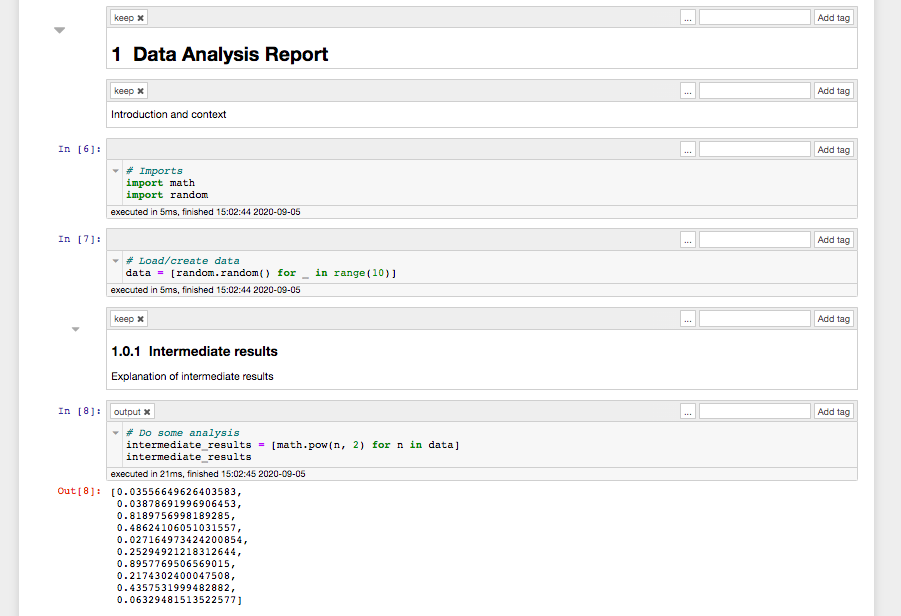
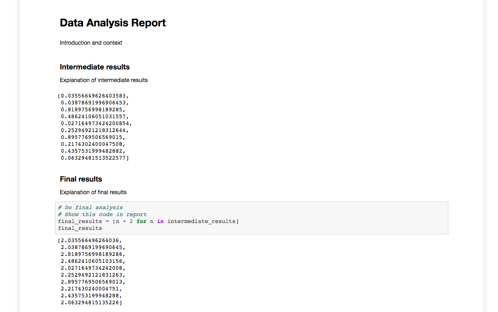
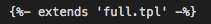
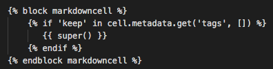
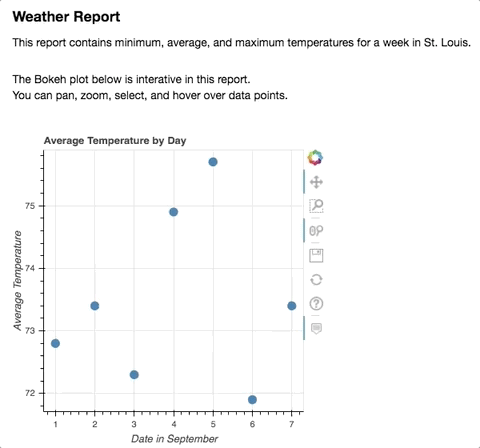

# nbconvert for converting Jupyter notebooks to static reports  

When working on data projects, it's important to ensure that your analysis is solid, repeatable, and provides business value. But equally important is making sure that you communicate your findings and insights clearly to teammates and business stakeholders. 

While interactive dashboarding platforms such as Tableau and PowerBI provide a plethora of options for visualizing your results and allow end users great power to be able to continue analysis on their own, they take a lot of time to set up (initially and for each report) and cost money. Additionally, oftentimes stakeholders desire a simpler format that is still both user-friendly and visually attractive. 

The trick is producing high quality reports, without taking away too much of your time from doing the actual analysis. That's where [nbconvert](https://nbconvert.readthedocs.io/en/latest/) and an [HTML template](https://nbconvert.readthedocs.io/en/latest/customizing.html) can help. You can use them to convert the Jupyter notebooks you use for analysis into an HTML file that can be shared a number of ways. 

This example shows part of my [sample analysis notebook](My%20Analysis%20Notebook.ipynb), which includes importing libraries and loading data along with other steps that are not useful to my report reader:

Now here is the entire [HTML report](My%20Analysis%20Notebook.html) without the parts of my Jupyter notebook or analysis that the report reader does not care about: 

There are several reasons I like this pattern: 
- It uses existing tools -  a custom HTML template is all I have to make myself
- It produces an HTML file which can be emailed, saved to a shared drive, Slacked, or served over a network with a basic web server
- A report can still contain interactive plots, for example if you use libraries such as Bokeh
- It uses my analysis notebook and does not require reproducing any of my code or results somewhere else

For this post, I started with a very basic HTML template to create reports that are read top to bottom, but you can make templates as complex as you want. See the [jinja2 documentation](https://jinja.palletsprojects.com/en/2.11.x/) for more details on designing templates.

The most important thing is that this process builds the report _directly from your analysis notebook_ meaning you do not have to reproduce your outputs (which oftentimes includes reproducing the loading data, data manipulation, etc.) in another script or tool just to produce the report.

The process is simple:
- Do analysis in your Jupyter notebook
- Include markdown cells with context, explanations, and insights
- Use the Jupyter [cell tag feature](https://nbconvert.readthedocs.io/en/latest/removing_cells.html) to mark the input cells, output cells, and markdown cells that you want to appear in the report
- Save the notebook
- Run nbconvert either from the command line or from within the Jupyter notebook itself
- Finally, distribute your report (more on this in a bit)

Let's see how it works.

### The HTML Template
As stated above, I started with a very [basic HTML template](report.tpl) to create reports that are read top to bottom. It inherits from the default `full.tpl` template that comes with nbconvert. Here's the line in the template that declares the inheritance:    
  
Next, the template has logic to look for certain Jupyter cell tags in each of the four types of cells: code input, code output, markdown, raw. This snippets looks for the tag `keep` in markdown cells - if it finds one then it includes the cell in the HTML, otherwise it drops the cells.  

### Cell Tags
[Cell tags](https://blog.jupyter.org/jupyter-notebook-5-0-909c6c172d78#1754) are a feature in Jupyter to add metadata to any cell. This metadata can then be used by Jupyter extensions or other programs (such as nbconvert). The keywords I use in my tags (`keep`, `input`, `output`) are defined in the template logic described in the previous section.

### Saving the Notebook and Running nbconvert  
nbconvert reads the notebook file - not the current state of the notebook if you have it open. Thus, make sure to save the notebook before you run this command, which outputs the HTML report:  
`jupyter nbconvert "My Analysis Notebook.ipynb" --template "report.tpl" --output-dir "." --no-prompt`  
Let's break this down a bit:  
- `jupyter` is the main program 
- `nbconvert` is a subcommand that invokes the nbconvert program which comes with Jupyter
- `"My Analysis Notebook.ipynb"` is the name of the notebook I want to convert
- `--template "report.tpl"` is the name of my custom template that is in the same directory
- `--output-dir "."` is the destination directory for the new HTML file
- `--no-prompt` is a flag telling nbconvert that I do not want Jupyter input or output prompts in the report. Many [config options](https://nbconvert.readthedocs.io/en/latest/config_options.html) are available to change nbconvert's behavior

That's it! I can run the command from a terminal or from within the Jupyter notebook itself by putting a `!` in front of it. See the last cell in the [sample analysis notebook](My-Analysis-Notebook.ipynb) for an example.

### Benefits
This process allows me to give folks what is essentially my analysis notebook, but they do not need to install Jupyter to view it nor do I have to host a Jupyter server that gives the users the ability to execute Python code on the host machine. It also does not require me to duplicate any of my code or results.

### Distributing the Report  
Because the report is a single, standalone HTML file, there are a variety of ways to share it with stakeholders:
- As the body of an email or an attachment to an email
- Save it to a shared drive, Sharepoint, Google Drive, or any other shared file location
- Upload it to AWS S3 bucket that is set up to serve static webpages
- Use a web server such as gunicorn or nginx to server it as static webpage
- Use Python's built in simple [http server](https://docs.python.org/3/library/http.server.html)
- Use a flask app for dynamic execution and serving of reports that are updated whenever the page is loaded (real time reports)

### Interactive Example
Finally, here is an example of a report that contains an interactive Bokeh chart. This allows the report reader to have some ability to investiage the data or results themself. 

Thanks for reading!

